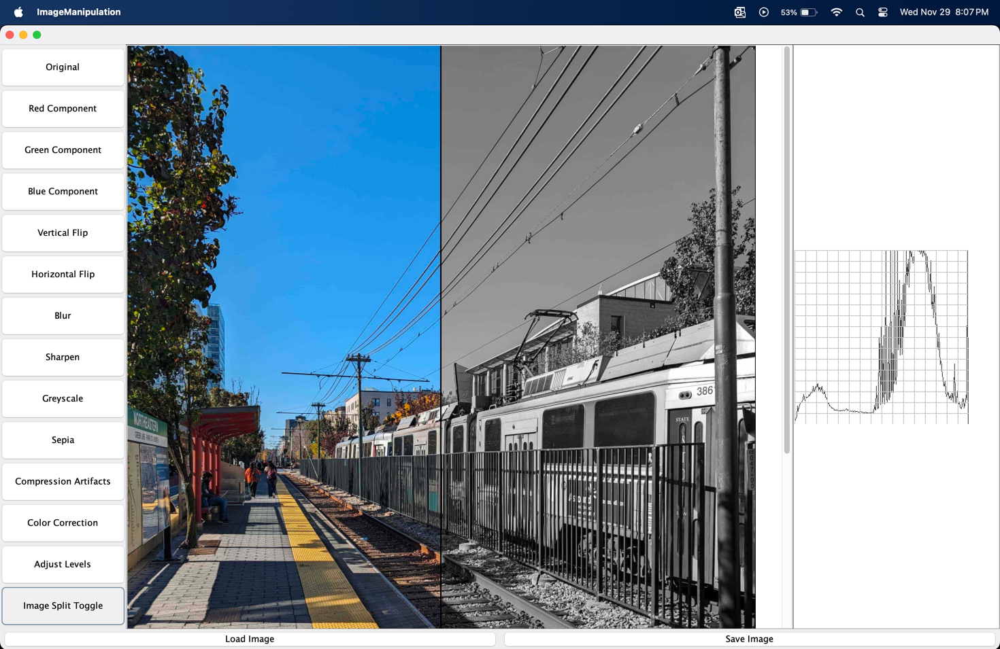

# Image Processing Application

This comprehensive image processing application provides a wide range of functionalities to load,
process, and save image files. It's designed to be user-friendly, allowing you to either run a
script of commands or enter commands manually in the terminal. This README provides an in-depth
overview of the classes, interfaces, and how to interact with the program.

## Table of Contents

1. [Introduction](#introduction)

2. [Classes and Interfaces](#classes-and-interfaces)

3. [Running the Application](#running-the-application)

+ [Manual Mode](#manual-mode)
+ [Script Mode](#script-mode)
+ [GUI Mode](#gui-mode)

4. [Command Reference](#command-reference)

5. [MVC Architecture](#mvc-architecture)

6. [Example Use Cases](#example-use-cases)

7. [Sample Script File](#sample-script-file)

8. [Image Source and Usage Authorization](#image-source-and-usage-authorization)
9. [Design Changes](#design-changes)
10. [Completeness](#completeness)

## Introduction

This image processing application allows users to perform various operations on image files. It is
comprised of several classes and interfaces, each serving a specific purpose in the image processing
workflow. The program adheres to the MVC architecture.

## Classes and Interfaces

### Image:

Represents an image, containing an array of image channels and a color combiner.

### CustomImage:

A concrete class extending the Image class with multiple constructors to create CustomImage objects.

---

### ImageFileHandler:

Provides a generic interface for reading and writing image files, supporting JPEG, PNG, and PPM
formats.

### AbstractImageHandler:

An abstract class that defines common methods for manipulating images, including flipping, rotating,
and resizing.

### JPEGFileHandler:

Concrete class implementing the ImageFileHandler interface for reading and writing JPEG images.

### PNGFileHandler:

Concrete class implementing the ImageFileHandler interface for reading and writing PNG images.

### PPMFileHandler:

Concrete class implementing the ImageFileHandler interface for reading and writing PPM images.

---

### ImageChannel:

Represents a single channel of an image, such as red, green, or blue.

### AbstractChannel:

An abstract class that provides a common interface for manipulating image channels, allowing
operations like adjusting brightness, contrast, and hue.

### Intensity:

Represents the intensity of a pixel in an image channel.

### Value:

Represents different intensity values used in image channels.

### Luma:

Represents the luma component of an image pixel.

---

### ImageColorComponent:

An interface representing a color component of an image.

### AbstractColorComponentExtractor

An abstract class that implements the ImageColorComponent interface.

### Red

A class that represents the red component of an image.

### Green

A class that represents the green component of an image.

### Blue

A class that represents the blue component of an image.

---

### ImageFlip:

An interface providing methods for flipping images horizontally and vertically.

### AbstractImageFlipper:

An abstract class implementing the ImageFlip interface, defining a template method for flipping
images.

### HorizontalFlip:

Concrete class implementing the ImageFlip interface for horizontal image flipping.

### VerticalFlip:

Concrete class implementing the ImageFlip interface for vertical image flipping.

---

### ImageBrightness:

Provides methods for adjusting the brightness of an image.

### AbstractBrightnessController:

An abstract class implementing the ImageBrightness interface, defining a template method for
brightness adjustments.

### Brighten:

A concrete class implementing the AbstractBrightnessController class, which increases image
brightness by a specified amount.

### Darken:

A concrete class implementing the AbstractBrightnessController class, which decreases image
brightness by a specified amount.

---

### ImageLinearColorTransform:

Provides methods for applying linear color transformations to images.

### AbstractColorTransform:

An abstract class implementing the ImageLinearColorTransform interface, defining a template method
for color transformations.

### Sepia:

A concrete class implementing the AbstractColorTransform class, converting an image to a sepia tone.

### Greyscale:

A concrete class implementing the AbstractColorTransform class, converting an image to grayscale.

---

### ImageFilters:

An interface with methods for applying various filters to images.

### ImageFilterTemplate:

An abstract class implements the ImageFilters interface and serves as a template for applying
filters to images.

### SharpenImage:

A concrete class implementing the ImageFilters interface for sharpening images.

### BlurImage:

A concrete class implementing the ImageFilters interface for blurring images.

---

### ImageColorCombiner:

An interface providing methods for combining image channels to form a color image.

### ImageColorCombinerImpl:

A concrete class implementing the ImageColorCombiner interface, combining image channels to form a
color image using the weighted average method.

---

### Controller:

The main entry point for the program. Parses command line arguments and creates objects to perform
requested operations.

### ControllerImpl:

A concrete class implementing the Controller interface. It parses command line arguments and creates
objects to perform requested operations.

### GuiController:

A new interface for the new controller that handles button clicks and new features required by the View.

### GuiControllerImpl

A concrete class implementing the GuiController.

### CommandDesign

An interface that uses the command design pattern to extend the design by decoupling present
commands by simply adding new classes for newer commands. This is used for classes having the same
operation structure but do different commands.

### BlurHelper

BlurHelper class follows Command Design pattern to interact with Model to blur image.

### BrightenHelper

BrightenHelper class follows Command Design pattern to interact with Model to brighten image.

### ColorComponentHelper

ColorComponentHelper class follows Command Design pattern to interact with Model to extract the
color component of the image.

### FlipImageHelper

FlipImageHelper class follows Command Design pattern to interact with Model to flip an image
vertically or horizontally.

### LoadHelper

LoadHelper class follows Command Design pattern to interact with Model to load an image.

### RepresentComponentHelper

RepresentComponentHelper class follows Command Design pattern to interact with Model to change the
color representation to value, luma or intensity an image.

### RGBCombineHelper

RGBCombineHelper class follows Command Design pattern to interact with Model to combine the red,
green and blue components of the three given images.

### RGBSplitHelper

RGBCombineHelper class follows Command Design pattern to interact with Model to split the red, green
and blue components of the given images to three component images.

### SaveHelper

LoadHelper class follows Command Design pattern to interact with Model to save an image.

### SepiaHelper

SepiaHelper class follows Command Design pattern to interact with Model to sepia an image.

### SharpenHelper

SharpenHelper class follows Command Design pattern to interact with Model to sharpen an image.


---

### Model:

An abstract class providing a common interface for representing and manipulating data in the
program.

### ModelImpl:

A concrete class implementing the Model interface, storing image data in a two-dimensional array.

### ModelGUI

An interface extending the original model but providing extra methods for implementation.

### ModelGUIImpl

A concrete class implementing the ModelGUI interface. This model doesn't use maps, since in the UI
the maps are not a requirement.

---

### SupportedColorComponents:

An enum representing different color components supported by the program.

---

### HaarWaveletCompression

An interface that defines functions for Haar compression.

### HaarWaveletCompressionImpl

A class that implements the HaarWaveletCompression and applies compression to an image with a given
percentage value.

---

### Histogram

An interface that defines functions for Histogram related operations - drawing and color correction.

### AbstractHistogram

An abstract class that abstracts the logic of drawing the histogram and color correction, since they
share a lot of functionality.

### ColorCorrection

A class that provides the user with functionality to color correct an image.

### VisualizeHistogram

A class that provides the user with functionality to draw a histogram for any image.

---

### OperationPreview

An interface that provides methods for previewing an image.

### OperationPreviewImpl

A class that implements the OperationPreview interface and allows user to preview operations
on some percent of the image.

---

### LevelAdjustment

An interface that provides methods to do level adjustment on an image.

### LevelAdjustmentImpl

A class that provides user functionality to do level adjustment using the black, mid and white
values.

---

### SupportedFormats:

An enum representing different image formats supported by the program.

---

### View
An interface with various methods to show user a GUI for directly interacting with the program graphically.

### ImageProcessingGUI
A concrete class implementing the View interface and allows user to interact with the app graphically.

---

## Running the Application

You can run the application in two ways: manual mode and script mode.

1. Go To the ImageManipulation.java file inside the src folder.
2. Run the ImageManipulation.java file.

### Manual Mode

In manual mode, you can type commands directly in the terminal. Here's how to run the program in
manual mode:

1. You can start entering commands in the terminal, and the application will execute them in
   real-time.

### Script Mode

In script mode, you provide a script file that contains a sequence of commands, and the application
will execute them one by one. Here's how to run the program in script mode:

1. Create a script file with a list of commands, as demonstrated in the provided script file.

2. Run the compiled program, providing the script file after the `run` command:

```bash

run script-train

```

Replace `script-train` with the name of your script file.

The application will read and execute the commands in the script file, performing image processing
operations as specified.
The script file can contain comments, starting with "#". The program will ignore the lines starting
with a `#` character.

### GUI Mode

In the GUI mode, the user has the ability to access a simple user interface to do all the image
related operations. The GUI supports functions such as 
+ Red, Green, Blue components of the image. 
+ Flipping the image - vertically and horizontally. Blurring and sharpening the image.
+ Also, allows the users to apply effects such as greyscale and sepia filters.
+ Compression to reduce the size of the image.
+ Color Correction
+ Adjusting levels - shadow, mid, and highlights.
+ Image preview operation - Image split toggle
Here's a screenshot showing the GUI
  

## Command Reference

The application supports a variety of commands to load, process, and save images. Here's a quick
reference for some of the available commands:

- `load <image_path> <image_name>`: Load an image from the specified path.

- `save <image_path> <image_name>`: Save the current image to the specified path.

- `brighten <amount> <image_name> <dest_image_name>`: Brighten the image by the given amount.

- `vertical-flip <image_name> <dest_image_name>`: Flip the image vertically.

- `horizontal-flip <image_name> <dest_image_name>`: Flip the image horizontally.

- `value-component <image_name> <dest_image_name>`: Create a grayscale image using the value
  component.

- `rgb-split <image_name> <red_image> <green_image> <blue_image>`: Split the image into its RGB
  components.

- `rgb-combine <image_name> <red_image> <green_image> <blue_image>`: Combine the RGB components to
  create a color image.

- `blur <image_name> <dest_image_name>`: Apply a blur effect to the image.

- `sharpen <image_name> <dest_image_name>`: Sharpen the image.

- `sepia <image_name> <dest_image_name>`: Apply a sepia tone effect to the image.

- `red-component <image-name> <dest-image-name>`: Get the red component from the image

- `run`: Runs the specified script file.

### MVC Architecture

The program follows the Model-View-Controller (MVC) architectural pattern:

- Model: Represents the data and core functionality of the application. It is responsible for
   processing image data. There are 2 models -- the explanation and reasoning behind using the two models
   is given in the Design Changes section.

- View: In this implementation, there is a GUI view for the user to interact with the 

- Controller: Acts as an intermediary, receiving commands from the View, invoking actions on the
  Model, and updating the View with the results. It parses command-line arguments and orchestrates
  the entire process.

## Example Use Cases

Here are some example use cases of the application:

1. **Loading and Saving Images**: Load images, apply various transformations, and save the results.

2. **Creating Grayscale Images**: Generate grayscale images using the value component.

3. **Color Component Manipulation**: Extract and modify specific color components (e.g., red, green,
   blue) of an image.

4. **Image Flipping**: Flip images vertically and horizontally.

5. **Brightness Adjustment**: Adjust the brightness of an image.

6. **RGB Component Manipulation**: Split images into RGB components and recombine them to create
   different effects.

7. **Image Filters**: Apply filters like blur, sharpen, and sepia to images.

## Sample Script File

```bash
load res/train.jpg trainImage  
  
#brighten train by adding 10  
brighten 10 trainImage train-brighter  
  
#flip train vertically  
vertical-flip trainImage train-vertical  
  
#flip the vertically flipped train horizontally  
horizontal-flip train-vertical train-vertical-horizontal  
  
#create a greyscale using only the value component, as an image train-greyscale  
value-component trainImage train-greyscale  
  
#save train-brighter  
save images/train-brighter.png train-brighter  
  
#save train-greyscale  
save images/train-gs.png train-greyscale  
  
#overwrite train with another file -> To Do check for that given path only  
load images/train-gs.png trainImage  
  
#give the train a red tint  
rgb-split trainImage train-red train-green train-blue  
  
#brighten just the red image  
brighten 50 train-red train-red  
  
#combine them back, but by using the brightened red we get a red tint  
rgb-combine train-red-tint train-red train-green train-blue  
save images/train-red-tint.png train-red-tint
```

## Image Source and Usage Authorization

The images used in this project are created by the author. The images in this project can be
used or modified for the purpose of this project.

## Design Changes
\
There have been design changes in a way that the GUI is using a new controller and a new model.
IMPORTANT: ALL THE OLD CODE IS STILL AS IS. Even if there are changes, the new things are essentially
extending the all code and hence keeping the original files unchanged.


**Why is the GUI using a new model?**
\
The GUI is using a new model because it made more sense to get rid of the hashmap that was being used
in the last 2 assignment, now that there is a GUI and we don't need to store older images in the map
, and we are simply working on the image that is actually visible. So to get rid of the map and avoiding heap
issues when a lot of operations are performed repeatedly on the image, a new model is created. 


Although there is a new model, it is simply extending the original model -- so it doesn't change the original
implementation at all and keeps the initial code untouched. The new model simply has 2 new methods that the GUI
controller can use and gets rid of the map.


**Why is there a new Controller?**
\
The controller was bound to change since there was no view in the last assignment and this one has a view, to
handle all the button clicks we needed a new controller to handle that.

The application still adheres to the MVC design pattern.

## Completeness
The code is fully functional and completely working and supports all the features from assignment 4, 5 as
well as the new ones in assignment 6.

