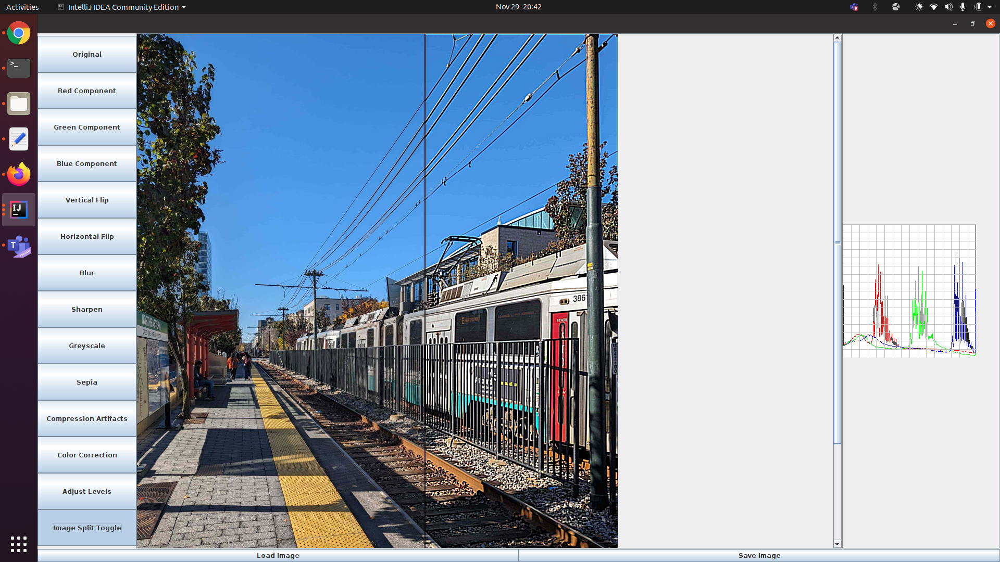

# USEME - Image Processing Application

Welcome to the Image Processing Application!
This document serves as a quick guide on the supported script commands,
examples of using them, and any relevant conditions for a seamless experience.

## Running the Application

You can run the application in three ways: GUI mode, manual text mode and script file mode.

### GUI Mode

#### Sample Image




#### Running the Program from JAR

Ensure you have Java installed on your system.

1. Navigate to the `res/` folder.
2. Run the following command:

   ```bash
   java -jar ImageManipulationGUI.jar
   ```

#### Running the Program from java file

1. Go To the ImageManipulation.java file inside the src folder.
2. Run the ImageManipulation.java file.

### GUI Features

#### Loading an Image

1. Click on the "Load" button.
2. Choose the image file you want to load from the file dialog.
3. The loaded image will be displayed in the main window.

#### Saving an Image

1. Click on the "Save" button.
2. Choose the destination to save the image.
3. Provide a file name and select the file format.
4. Click "Save" to save the image.

#### Original Image

- Click on "Original" to revert to the original loaded image.

#### Color Components

- Click on "Red Component," "Blue Component," or "Green Component" to isolate and display a specific
  color component.

#### Flipping

- Click on "Vertical Flip" or "Horizontal Flip" to flip the image vertically or horizontally.

#### Blur

1. Click on "Blur."
2. The blurred image will be displayed.

#### Sharpen

1. Click on "Sharpen."
2. The sharpened image will be displayed.

#### Greyscale (Luma Channel)

1. Click on "Luma."
2. The image with modified luma channel will be displayed.

#### Sepia

1. Click on "Sepia."
2. The sepia-toned image will be displayed.

#### Compression

1. Click on "Compression."
2. Enter the compression percentage when prompted.
3. The compressed image will be displayed.

#### Color Correction

1. Click on "Color Correct."
2. The color-corrected image will be displayed.

#### Adjusting Levels

1. Click on "Adjust Levels."
2. Enter black, mid, and white values when prompted.
3. The image with adjusted levels will be displayed.

#### Split Image

1. Click on "Split Toggle."
2. Enter the split percentage when prompted.
3. The split preview with the prev operated image and the current image is shown.
4. Toggle between split and full views using the Split Image button.

#### Histogram Image

The histogram image is available at all times once the image is loaded, on the right hand side of
the screen.

### Manual Mode

#### Running the Program from JAR

Ensure you have Java installed on your system.

1. Navigate to the `res/` folder.
2. Run the following command:

   ```bash
   java -jar ImageManipulationGUI.jar -text
   ```

In manual mode, you can type commands directly in the terminal. Here's how to run the program in
manual mode:

1. You can start entering commands in the terminal, and the application will execute them in
   real-time.

### Script Mode

#### Running the Program from JAR

Ensure you have Java installed on your system.

1. Navigate to the `res/` folder.
2. Run the following command:

   ```bash
   java -jar ImageManipulationGUI.jar -file script-train
   ```

In script mode, you provide a script file that contains a sequence of commands, and the application
will execute them one by one. Here's how to run the program in script mode:

1. Create a script file with a list of commands, as demonstrated in the provided script file.

The application will read and execute the commands in the script file, performing image processing
operations as specified.
The script file can contain comments, starting with "#". The program will ignore the lines starting
with a `#` character.

## Supported Script Commands

1. **Load an Image**
   ```bash
   load <image_path> <image_name>
   ```

- Example:
  ```bash
  load res/train.jpg trainImage
  ```
- Conditions: Ensure the image file exists at the specified path.

2. **Image Color Component Processor**
   ```bash
   red-component <image_name> <dest_image_name>
   blue-component <image_name> <dest_image_name>
   green-component <image_name> <dest_image_name>
   luma-component <image_name> <dest_image_name>
   intensity-component <image_name> <dest_image_name>
   ```
    - Example:
      ```bash
      red-component trainImage train-red-component
      ```
    - Conditions: The source image should be loaded before applying color component processing.

3. **Color Filter**
   ```bash
   blur <image_name> <dest_image_name>
   sharpen <image_name> <dest_image_name>
   sepia <image_name> <dest_image_name>
   ```
    - Example:
      ```bash
      blur trainImage train-blur
      ```
    - Conditions: Ensure the source image is loaded before applying filters.

4. **Brighten an Image**
   ```bash
   brighten <amount> <image_name> <dest_image_name>
   ```
    - Example:
      ```bash
      brighten 10 trainImage train-brighter
      ```
    - Conditions: The source image should be loaded before adjusting brightness.

5. **Image Flipping**
   ```bash
   vertical-flip <image_name> <dest_image_name>
   horizontal-flip <image_name> <dest_image_name>
   ```
    - Example:
      ```bash
      vertical-flip trainImage train-vertical
      ```
    - Conditions: The source image should be loaded before flipping.

6. **Create a Grayscale Image**
   ```bash
   value-component <image_name> <dest_image_name>
   ```
    - Example:
      ```bash
      value-component trainImage train-greyscale
      ```
    - Conditions: The source image should be loaded before creating a grayscale image.

7. **Save an Image**
   ```bash
   save <image_path> <image_name>
   ```
    - Example:
      ```bash
      save images/train-brighter.png train-brighter
      ```
    - Conditions: Ensure the destination path is valid, and the image to save is loaded.

8. **Overwrite an Image**
   ```bash
   load <image_path> <image_name>
   ```
    - Example:
      ```bash
      load images/train-gs.png trainImage
      ```
    - Conditions: Ensure the image file exists at the specified path.

9. **RGB Component Manipulation**
   ```bash
   rgb-split <image_name> <red_image> <green_image> <blue_image>
   brighten <amount> <red_image> <red_image>
   rgb-combine <dest_image_name> <red_image> <green_image> <blue_image>
   ```
    - Example:
      ```bash
      rgb-split trainImage train-red train-green train-blue
      ```
    - Conditions: Ensure the source image is loaded before manipulating RGB components.

10. **Example Sequence of Commands**
    ```bash
    # Load an image
    load res/train.jpg trainImage

    # Extract red component
    red-component trainImage train-red-component

    # Brighten the red component
    brighten 50 train-red-component train-brightened-red

    # Combine the components back
    rgb-combine train-red-tint train-brightened-red train-green train-blue

    # Save the result
    save images/train-red-tint.png train-red-tint
    ```
11. **Compression**
   ```bash
   load res/train.jpg trainImage
   compress 80 trainImage trainCompressed80
   compress 99 trainImage trainCompressed99
   save res/trainCompressed80.png trainCompressed80
   save res/trainCompressed99.png trainCompressed99
   ```

12. **Operation Preview**
   ```bash
      load res/train.jpg trainImage
      sepia trainImage trainSepia split 50
      sharpen trainImage trainSharpen split 25
      save res/preview-sharpened.jpg trainSharpen
      save res/preview-sepia.jpg trainSepia
   ```

13. **Histogram**
   ```bash
      histogram trainCompressed99 trainCompressed99-histogram
      save res/trainCompressed99-histogram.png trainCompressed99-histogram
   ```

14. **Color Correction**
   ```bash
   color-correct trainImage colorCorrectedTrain
   save res/colorCorrectedTrain.jpg colorCorrectedTrain
   save res/Histogram-colorCorrectedTrain.jpg Histogram-colorCorrectedTrain
   ```